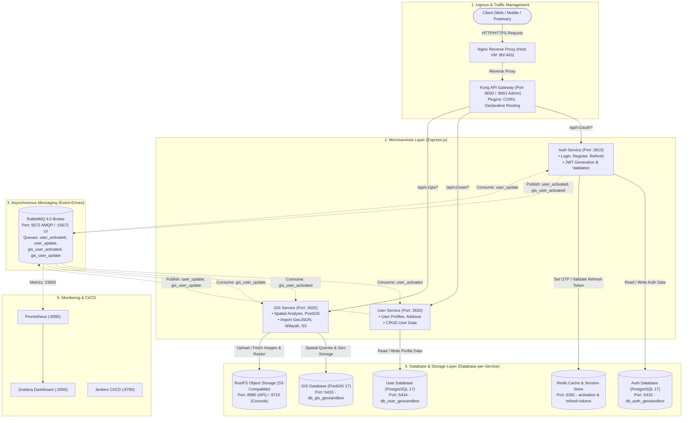
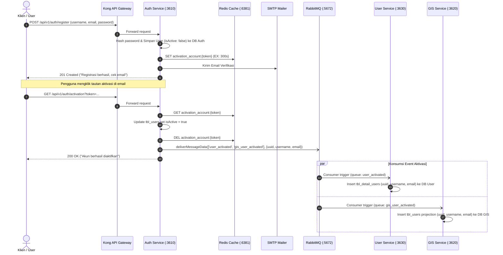
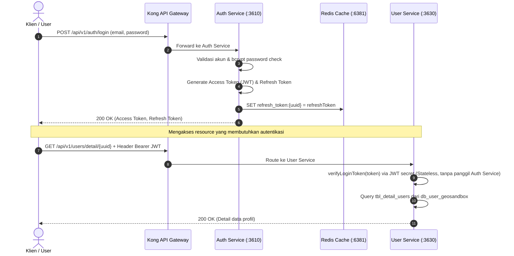
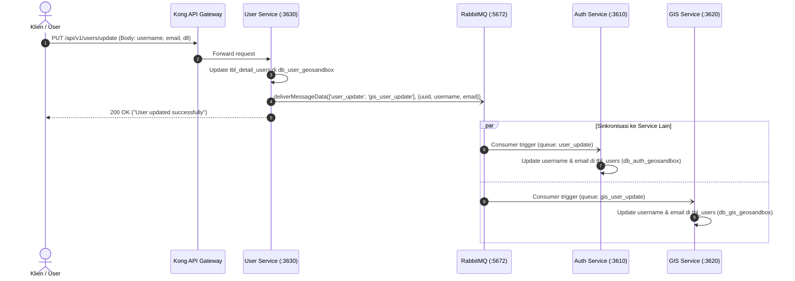
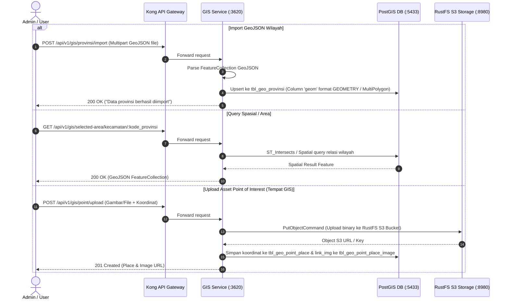

Listed directory Express.js
Listed directory be-geosandbox-infrastructure
Viewed README.md:1-32
Viewed compose.yaml:1-9
Listed directory api-gateway
Viewed kong.yml:1-67
Listed directory message-broker
Viewed docker-compose.yml:1-25
Listed directory monitoring
Listed directory be-geosandbox-database-s3
Viewed compose.yaml:1-124
Listed directory be-geosandbox-auth-service
Viewed package.json:1-34
Listed directory src
Viewed app.js:1-57
Viewed auth.route.js:1-62
Listed directory message-broker
Viewed user.subscriber.js:1-71
Listed directory services
Viewed auth.service.js:1-61
Viewed auth.controller.js:1-162
Listed directory be-geosandbox-user-service
Listed directory src
Viewed app.js:1-57
Viewed user.route.js:1-55
Viewed user.subscriber.js:1-74
Viewed user.controller.js:1-59
Viewed address.route.js:1-19
Listed directory be-geosandbox-gis-service
Viewed package.json:1-39
Listed directory src
Viewed app.js:1-56
Viewed user.subscriber.js:1-75
Viewed provinsi.routes.js:1-17
Viewed selected-area.routes.js:1-19
Viewed storage-s3.config.js:1-24
Searched for "rustfsClient"
Searched for "rustfsClient"
Searched for "upload"
Viewed provinsi.controller.js:1-70
Viewed provinsi.service.js:1-60
Viewed compose.yaml:1-21
Viewed compose.yaml:1-21
Viewed compose.yaml:1-21
Listed directory models
Viewed tblauth.js:1-58
Listed directory models
Viewed detailusers.js:1-63
Viewed tbladdressusers.js:1-58
Listed directory models
Viewed detailusers.js:1-39
Viewed tblpointplace.js:1-47
Viewed tblgeopointplaceimage.js:1-37
Listed directory routes
Viewed kabupaten.routes.js:1-16
Listed directory middlewares
Viewed auth.middleware.js:1-41
Viewed data-cache.config.js
Listed directory config
Listed directory middlewares
Viewed guard.middleware.js:1-44
Viewed docker-compose.yml:1-34
Viewed docker-compose.yml:1-33
Listed directory cicd-workflow
Viewed compose.yaml:1-27

Berdasarkan hasil penelusuran langsung pada 5 direktori repository proyek Anda:

1. [be-geosandbox-infrastructure](file:///media/pratiwi24/c7468a67-9c5e-4403-93e8-cadc33a9abaf19/Project%20App/Express.js/be-geosandbox-infrastructure)
2. [be-geosandbox-database-s3](file:///media/pratiwi24/c7468a67-9c5e-4403-93e8-cadc33a9abaf19/Project%20App/Express.js/be-geosandbox-database-s3)
3. [be-geosandbox-auth-service](file:///media/pratiwi24/c7468a67-9c5e-4403-93e8-cadc33a9abaf19/Project%20App/Express.js/be-geosandbox-auth-service)
4. [be-geosandbox-user-service](file:///media/pratiwi24/c7468a67-9c5e-4403-93e8-cadc33a9abaf19/Project%20App/Express.js/be-geosandbox-user-service)
5. [be-geosandbox-gis-service](file:///media/pratiwi24/c7468a67-9c5e-4403-93e8-cadc33a9abaf19/Project%20App/Express.js/be-geosandbox-gis-service)

Berikut adalah visualisasi alur sistem (arsitektur global dan alur per skenario) menggunakan diagram interaktif serta penjelasan mendalam mengenai konsep microservice yang diimplementasikan.

---

### 1. Diagram Arsitektur Global (System Topology)

Arsitektur sistem ini mengadopsi **Event-Driven Microservices** dengan **API Gateway Pattern** dan **Database-per-Service Pattern**. Seluruh kontainer terhubung melalui satu Docker Network bersama (`global-network-geosandbox`).

---

### 2. Alur Setiap Service (Flow Diagrams)

#### Alur A: Registrasi, Aktivasi Akun, & Sinkronisasi Antar Service

Alur ini menggambarkan bagaimana registrasi diautentikasi oleh `auth-service`, kemudian disinkronisasikan ke `user-service` dan `gis-service` secara **asinkron (asynchronous)** via RabbitMQ tanpa membuat service saling memanggil langsung via HTTP.

---

#### Alur B: Login & Akses Endpoint Terproteksi (Stateless JWT Guard)

Menggambarkan pemisahan antara pengeluaran token (Auth Service) dan verifikasi token oleh service hilir (`user-service` dan `gis-service`).

---

#### Alur C: Update Profile & Sinkronisasi Balik (Eventual Consistency)

Ketika user memperbarui profil di `user-service`, data email dan username harus ikut berubah di `auth-service` dan `gis-service`.

---

#### Alur D: GIS Ingestion, Spatial Query, & Object Storage (RustFS S3)

Alur pemrosesan data geospasial khusus pada `gis-service`.

---

### 3. Penjelasan Konsep Microservice Pada Arsitektur Ini

Arsitektur Geosandbox ini mengimplementasikan pola-pola standar industri (_design patterns_) microservice sebagai berikut:

#### 1. Single Responsibility Principle & Domain-Driven Design (DDD)

Setiap service memiliki batasan konteks (_Bounded Context_) yang tegas dan tugas spesifik:

- **[Auth Service](file:///media/pratiwi24/c7468a67-9c5e-4403-93e8-cadc33a9abaf19/Project%20App/Express.js/be-geosandbox-auth-service)**: Berfokus hanya pada identitas, kredensial keamanan (password hash), token JWT, aktivasi akun, dan hak akses (RBAC).
- **[User Service](file:///media/pratiwi24/c7468a67-9c5e-4403-93e8-cadc33a9abaf19/Project%20App/Express.js/be-geosandbox-user-service)**: Berfokus pada entitas profil pengguna (`DetailUsers`), alamat (`TblAddressUsers`), nomor telepon, foto profil, dan informasi demografis.
- **[GIS Service](file:///media/pratiwi24/c7468a67-9c5e-4403-93e8-cadc33a9abaf19/Project%20App/Express.js/be-geosandbox-gis-service)**: Berfokus pada domain spasial/pemetaan, seperti batas administrasi (Provinsi, Kabupaten), titik lokasi (_Point Place_), koordinat poligon, serta integrasi storage file geospasial.

#### 2. Database-per-Service Pattern (Loose Coupling)

Setiap microservice memiliki basis data tersendiri di [compose.yaml database-s3](file:///media/pratiwi24/c7468a67-9c5e-4403-93e8-cadc33a9abaf19/Project%20App/Express.js/be-geosandbox-database-s3/compose.yaml):

- `auth_service_db` (`db_auth_geosandbox` - PostgreSQL port 5432)
- `user_service_db` (`db_user_geosandbox` - PostgreSQL port 5434)
- `gis_service_db` (`db_gis_geosandbox` - PostGIS port 5433)

**Keuntungan:**

- **Polyglot Persistence**: GIS Service dapat menggunakan ekstensi PostGIS khusus kalkulasi geometri spasial tanpa membebani database auth atau user.
- **Isolasi Kegagalan (_Fault Isolation_)**: Jika database GIS kehabisan memori atau _crash_, layanan autentikasi dan login pengguna tetap berjalan normal.
- Mencegah ketergantungan join tabel antar service secara langsung.

#### 3. API Gateway Pattern (Kong + Nginx)

Klien luar tidak memanggil port internal service (port 3610, 3620, 3630):

- Diatur melalui [kong.yml](file:///media/pratiwi24/c7468a67-9c5e-4403-93e8-cadc33a9abaf19/Project%20App/Express.js/be-geosandbox-infrastructure/api-gateway/kong.yml).
- Menyediakan **Unified Entry Point** (`/api/v1/auth`, `/api/v1/user`, `/api/v1/gis`).
- Memusatkan kebijakan global seperti CORS, SSL termination di Nginx, dan abstraksi topologi internal kontainer.

#### 4. Asynchronous Event-Driven Architecture (EDA) & Eventual Consistency

Alih-alih memanggil HTTP REST API antarservice (yang membuat service saling bergantung dan rentan _cascade failure_), komunikasi antarservice menggunakan antrean pesan (**RabbitMQ**):

- **Publisher & Subscriber (Pub/Sub)**:
  - Saat `ActivationController` di `auth-service` dijalankan, pesan dikirim ke `user_activated` dan `gis_user_activated`.
  - Saat profil diupdate di `user-service`, pesan dikirim ke `user_update` dan `gis_user_update`.
- **Data Projections / CQRS-Lite**:
  - `gis-service` menyimpan tabel proyeksi lokal `tbl_users` berisi `uuid`, `username`, `email`. GIS service tidak perlu melakukan query jarak jauh via HTTP ke user-service saat butuh informasi dasar pengguna, sehingga performanya sangat cepat.
- **Eventual Consistency**: Data di ketiga service akan sinkron dalam hitungan milidetik setelah event diproses oleh consumer RabbitMQ.

#### 5. Stateless Authentication & Distributed Session (JWT + Redis)

- Token autentikasi berupa JWT yang ditandatangani dengan secret key.
- Service hilir (`user-service` dan `gis-service`) dapat memverifikasi keabsahan JWT secara mandiri tanpa harus memanggil `auth-service` pada setiap request masuk.
- **Redis** digunakan untuk hal-hal yang butuh TTL (_Time-To-Live_) dan revocability cepat:
  - Token aktivasi akun via email (kedaluwarsa dalam 300 detik).
  - Penyimpanan `refresh_token:{uuid}` untuk mendukung fitur Logout / pencabutan sesi secara terpusat.

#### 6. Decoupled Object Storage (RustFS S3)

- File statis berukuran besar (seperti foto tempat, GeoTIFF, atau peta) tidak disimpan di dalam database relasional maupun filesystem lokal kontainer (yang bersifat _ephemeral_).
- File dialihkan ke **RustFS** yang kompatibel dengan protokol AWS S3 API (Port 8980), memudahkan penskalaan (_horizontal scaling_) jika sistem ingin dimigrasikan ke AWS S3, MinIO, atau Cloudflare R2.

#### 7. Observability & DevSecOps Ready

Di folder [be-geosandbox-infrastructure](file:///media/pratiwi24/c7468a67-9c5e-4403-93e8-cadc33a9abaf19/Project%20App/Express.js/be-geosandbox-infrastructure):

- **Prometheus & Grafana**: Memantau metrik throughput pesan RabbitMQ (port 15692), penggunaan resource host melalui Node Exporter, dan performa kontainer.
- **Jenkins & GitHub Actions Runner**: Menjamin otomatisasi integrasi dan deployment (CI/CD) ke server VM/EC2 secara konsisten.
